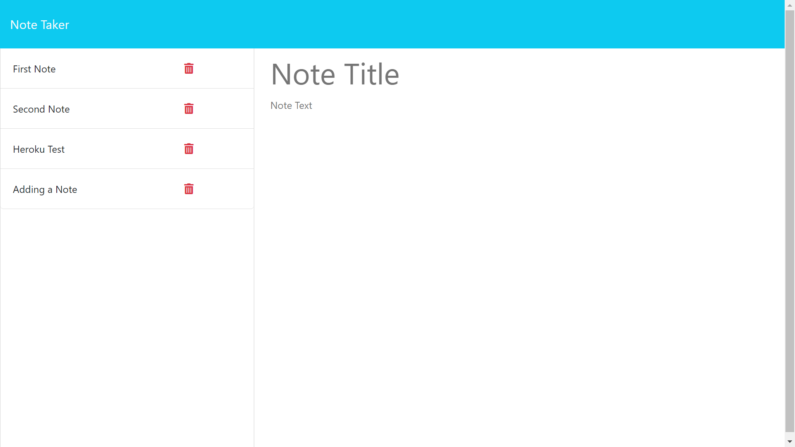

# Express Notetaker App

## Description

The Express Notetaker App is a simple application users can utilize to take notes on the go! Built with Express.js, Node.js, HTML and JavaScript, it is a lean, usable application capable of storing any thoughts you may have!

## Table of Contents
* [Access](#Installation)
* [Demo](#Demo)
* [Questions](#Questions)

## Access 

Simply go to https://cryptic-dusk-35907-97b76dd3d06b.herokuapp.com/ to start using the app, no installation required.  The intuitive UI will guide you through adding new notes, displaying past notes, and deleting notes you don't need anymore!

## Demo 

Following the [aforementioned link](https://cryptic-dusk-35907-97b76dd3d06b.herokuapp.com/) will take you to the apps homepage.

Click on the "Get Started" button to get to https://cryptic-dusk-35907-97b76dd3d06b.herokuapp.com/notes, where you can add title and text for your new notes.

Add your Note Title and Note Text.  Once complete, click the "Save Note" button to add it to your active note list on the left-hand column.

You can view past notes by clicking on their title listed in the left-hand column.  You can also remove them from the list by clicking on the red trash symbol (but beware, this will remove the note FOREVER).

## Questions 

Reach out at my [GitHub!](https://github.com/JustDesmarais)